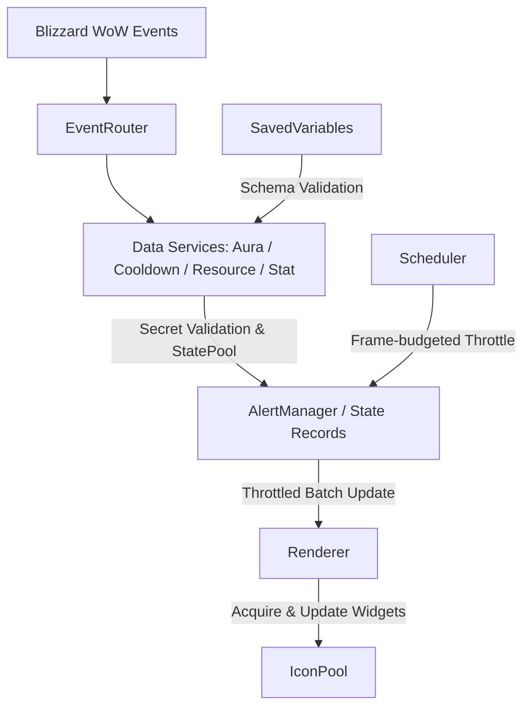

<!-- EAM_DOCUMENTATION_SOURCE: enUS -->
# System Architecture

## Root Directory Structure & Responsibilities (Current)

- `D:\Project_EventAlertMod` is the Git project root; `EventAlertMod/` is the sole AddOn runtime source tree; `.AI/` contains AI governance, documentation, validation tools, and test suites; `Deploy/` houses deployment scripts and packaging tools; `Dist/` is the ignored local build artifacts directory.
- The AddOn runtime boundary includes only files listed in `EventAlertMod/EventAlertMod.toc`: `Core/`, `Data/` runtime Lua, `Debug/`, `Locale/`, `Managers/`, `Media/`, `Services/`, and `UI/`. Files under `.AI/Docs`, `.AI/Tools`, and `.AI/Data` must NEVER be loaded by the TOC.
- AddOn release ZIPs must be the exact tree of `EventAlertMod/`. Source ZIPs may include `.vscode/`, `.codex/`, and `.AI/` (including `.AI/docs_html/`), strictly excluding local artifacts and temporary scratch files.
- Automated deployment scripts must perform three-way version / target / Reparse Point checks before modifying WoW directories. Any SymbolicLink or Junction must fail-closed.

---

## Modern Module Decoupling & Mapping

### 1. Core Layer (`EventAlertMod/Core/`)
- **`Env.lua`**: Runtime namespace (`EAM`), environment probes, build flavor checks, and Retail-only guards.
- **`Util.lua`**: Safe arithmetic, object pooling helpers, table traversal, enum helpers, and defensive assertions.
- **`Constants.lua`**: Global enumerations, alert kinds, frame types, layout direction offsets, and schema versions.
- **`EventRouter.lua`**: Single-frame event bus. Manages dynamic `OnEvent` subscriptions and dispatch tables.
- **`Scheduler.lua`**: Unified central `OnUpdate` scheduler. Enforces frame-budgeted callbacks and throttled tasks without per-icon timers.
- **`SavedVariables.lua`**: Data schema migration, validation, class profiles, and transactional mutation helpers.

### 2. Services Layer (`EventAlertMod/Services/`)
- **`AuraService.lua`**: Safe player and target aura monitoring with shield absorb accumulation.
- **`CooldownService.lua`**: Charge-based spell cooldown tracking, exact player cast activation, and pre-render placeholder management.
- **`ItemCooldownService.lua`**: Trinket, equipment, and consumable cooldown queues.
- **`SpellInfoService.lua`**: Caching layer for spell names, icons, and links via `C_Spell`.
- **`PlayerResourceService.lua`**: Multi-class resource tracking (Combo Points, Holy Power, Chi, Soul Shards, Runes, Arcane Charges, etc.).
- **`PlayerStatService.lua`**: 18-stat real-time monitor, 4-in-1 speed measurements, and Secret-safe `StatusBar` sinks.
- **`GroundEffectService.lua`**: Ground AoE spell detection with Base/Override talent family matching.
- **`GroupService.lua`**: Multi-dimensional tactical tagging and group management.

### 3. UI & Rendering Layer (`EventAlertMod/UI/`)
- **`IconPool.lua`**: Recycled allocation of icon buttons, textures, cooldown frames, borders, and font strings.
- **`Renderer.lua`**: Consumes normalized `AlertState` records to update visual widgets; never queries Blizzard `C_*` data APIs directly.
- **`Options.lua`**: Modern settings interface with 3-level APPEND docking, live preview, and multi-select dropdowns.
- **`Slash.lua`**: Command-line parser for `/eam` slash commands.

### 4. Diagnostic & Testing (`EventAlertMod/Debug/`)
- **`DebugState.lua`**: Comprehensive runtime snapshots separating facts, derived states, boundary warnings, and environment stats.
- **`RuntimeProbe.lua`**: Safe metadata inspection without triggering Secret access violations.

---

## Data Flow Architecture

1. Blizzard engine events enter **`EventRouter`**.
2. `EventRouter` dispatches payloads to registered services.
3. Services query safe Retail APIs (`C_Spell`, `C_UnitAuras`, etc.) and update runtime state objects.
4. Services acquire state buffers from zero-allocation **`StatePool`** and emit normalized `AlertState` records.
5. **`AlertManager`** batches and throttles layout dirty flags.
6. **`Renderer`** receives state records and updates pooled visual frames from **`IconPool`**.
7. In-combat mutations are either pre-anchored via `SetAlpha(0)` / desaturated masks or deferred to `PLAYER_REGEN_ENABLED`.

---

## 12.1 Native Aura vs. Legacy Routing

- **Retail 12.1.0+**: Routes through `AuraCapabilityService` ➔ `AuraRuleCompiler` ➔ `AuraContainerService` ➔ Blizzard native `CustomAuraContainer` / `AuraButton`.
- **Legacy 12.0.7 Fallback**: Retains the `AuraService` ➔ `AlertManager` ➔ `Renderer` ➔ `IconPool` pipeline.
- Native Aura does not create `AuraState` objects, emits no `EAM_AURA_STATE_CHANGED` events, and bypasses the legacy scheduler token queue.
