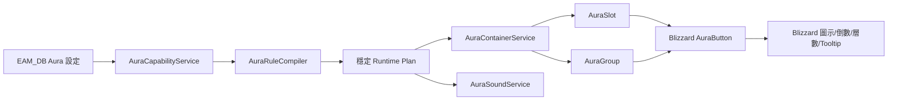
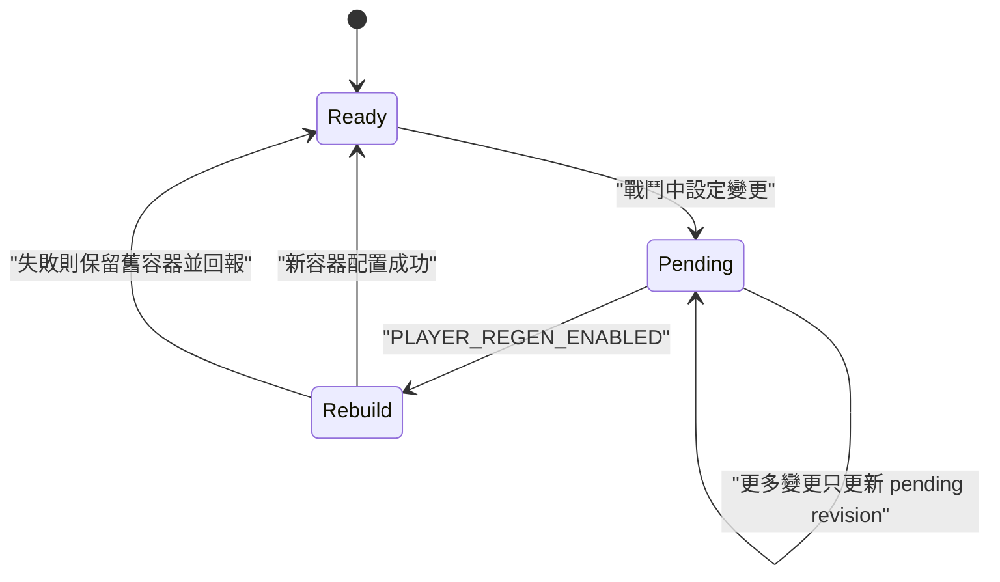

<!-- EAM_DOCUMENTATION_SOURCE: zh-TW -->
# Retail 12.1 AuraContainer Native Backend 實作規格

## 文件狀態

- 初始實作基準：Retail 12.1.0 build 68914；AuraSound 現行固定查證更新至 build 69273。
- 程式狀態：Native backend、Legacy 隔離、流程 mock 與報告入口已完成。
- 驗證狀態：Lua 5.1 離線流程與初始化期 mutation mock 已通過；尚未在 `_ptr_` 進行 Aura 顯示、聲音、Forbidden Aspect、taint 與戰鬥行為簽收。
- 支援範圍：Retail only；Classic 不在本專案範圍。

## API 事實基準

68914 已確認以下公開契約：

| 能力 | 68914 契約 | EAM 使用方式 |
| --- | --- | --- |
| 容器 | `CreateFrame("AuraContainer", nil, UIParent, "CustomAuraContainerTemplate")` | 只在脫戰建立 |
| 單格 | `AddAuraSlot(slotKey, filterString, options)` | player/target 各保留第一條穩定規則 |
| 群組 | `AddAuraGroup(groupKey, filterString, options)` | 合併相同 unit/filter/caster 規則 |
| 佈局 | `SetAuraGroupLayout(groupKey, layout)` | 脫戰一次套用 |
| 排序 | `AuraContainerSortMethod.Default`、`AuraContainerSortDirection.Normal` | FrameXML 全域表，不使用 `Enum.*` |
| 外觀 | `CustomAuraButtonTemplate` 與 `initializeFrame` | 在存取限制套用前綁定 Region |
| 名稱 | `AuraButton:SetSpellName(FontString)` | 由 Blizzard 寫入文字，不讀 AuraData |
| 倒數 | `SetDurationCooldown`、`SetDurationText` | 由 Blizzard/DurationObject 更新 |
| 層數 | `SetApplicationCount(FontString)` | 不由 Lua 讀取 applications |
| 邊框 | `AuraContainerUtil.AddDispelTypeTexture` | 只用於 Blizzard 定義的驅散類型外觀，不當成任意 Glow |
| 音效 | `C_UnitAuras.AddAuraSound` / `RemoveAuraSound` | 管理三種 trigger 的註冊 ID |

公開 API 沒有 `RemoveAuraSlot` 或 `RemoveAuraGroup`。刪除規則時，EAM 會建立新容器、成功後才停用舊容器；不修改 Blizzard 私有 mixin。

### 68914 初始化與顯示邊界

- `AuraButton`、Cooldown、FontString、錨點、字級、swipe 與 Blizzard 輔助 texture 都只在 `initializeFrame` callback 內設定。初始化完成後不追蹤按鈕並直接 mutation。
- 一般模式呼叫 `Cooldown:SetHideCountdownNumbers(true)`，只保留 `SetDurationText` 的一組原生倒數，避免 CooldownFrameTemplate 內建數字與 EAM DurationText 重疊。
- 「雙倒數診斷」刻意同時顯示兩種原生機制，只供玩家比較開始、中段、結束的同步性。切換後須於脫戰重建 Native container；不可在既有 AuraButton 上即時修改。
- `AddDispelTypeTexture` 表達的是驅散類型／官方 Aura 外觀，不是可任意套用的 proc、Pandemic 或監控命中 Glow。EAM 保留既有 Glow 語意，Native border 能力另列實機觀察，不混用。
- 圖示存在但時間或 applications 空白，可能是 Secret／display-only、無正 duration、applications 小於等於 1，或目標 Aura 身分切換；不得以猜測秒數或層數補值。

## 架構



Native 路徑不得建立 `AuraState`，不得送出 `EAM_AURA_STATE_CHANGED`，不得進入 `AlertManager`、一般 `Renderer`、`IconPool` 或 Scheduler expiration token。

12.0.7 的 Legacy 路徑仍保留：

```text
Readable AuraData -> AuraService -> AlertManager -> Renderer -> IconPool
```

12.1 若 Native API 不完整，後端狀態為 `UNSUPPORTED`；不得偷偷回退到可能讀取 Secret AuraData 的 Legacy 路徑。

## 模組責任

| 模組 | 責任 | 禁止事項 |
| --- | --- | --- |
| `AuraCapabilityService` | Interface 初篩、feature detection、後端選擇 | 只看版號就宣稱 Native |
| `AuraRuleCompiler` | 設定轉 `NATIVE_SLOT/GROUP`、`READABLE_LEGACY`、`DISPLAY_UNSUPPORTED` | 讀即時 AuraData、操作 UI |
| `AuraContainerService` | 脫戰建立、revision/fingerprint、pending rebuild | 戰鬥中改容器結構 |
| `NativeAuraRenderer` | `initializeFrame` Region 綁定與靜態錨點 | OnUpdate、OnShow/OnHide 狀態推導 |
| `AuraSoundService` | 註冊與解除 Sound ID | 從 AuraData 推導事件 |

## 規則編譯

- key 僅由 SavedVariables 的普通 `alertID` 產生，格式為 `EAM_SLOT_*` 或 `EAM_GROUP_*`。
- `includeSpellIDs` 僅使用玩家設定中的普通正整數 Spell ID。
- 每個 unit 的第一條規則編譯為 Slot；其餘相同 unit/filter/caster 規則合併為 Group。
- 未指定 filter 時，player 推導為 `HELPFUL`、target 推導為 `HARMFUL`，並記錄 `auraFilterInferred` limitation。
- Secret identity filter 只保證友方 helpful 或敵方 harmful；反向極性標記 `secretIdentityFilterMayBeRejected`，須 PTR 驗證。
- `containerFingerprint` 只包含 schema、backend、layout 與實際規則 key/filter；`soundFingerprint` 另含 unit、SpellID、trigger、asset、channel 與 master 狀態。純音效變更不得重建容器。

## 戰鬥生命週期



68914 FrameXML 已允許 AddOn 在戰鬥中建立 AuraContainer；EAM 仍採「只在脫戰改結構」的保守工程政策。這是 EAM 政策，不應誤寫成 68914 API 限制事實。

## 音效策略

- 全域 `showSound` 在 Native backend 預設只註冊 `Added`，沿用既有音效選單資產。
- 每條 Aura alert 可明確提供 `added`、`applicationsIncreased`、`removed` 設定。
- 相同 sound fingerprint 不重複註冊；先完整建立 candidate registry 才交換 active registry，Add 失敗保留舊註冊，Remove 失敗保留 retired ID 供重試。
- 離線測試只證明註冊 ID 生命週期，不證明遊戲實際播放次數或音量通道。

## SavedVariables v5

- `schemaVersion = 5`；alert lists 依 active class profile 隔離，AuraSound 為 v5 上的 additive 純資料，不保存 runtime registration ID。
- v1 遷移前保存 `migrationBackups.auraSchemaV1` 的可序列化 Aura 設定。
- 遷移中途失敗會還原遷移前可序列化 DB，並寫入靜態 warning code。
- Alert 可保存 filter、顯示偏好與 sound 純資料；不得保存 Frame、ScriptObject、DurationObject 或 AuraContainer。
- 相同 alert/options 再次送入回傳 `unchanged`，不增加 revision。

## 驗證入口

離線：

```powershell
powershell -NoProfile -ExecutionPolicy Bypass -File .\Tools\Run-FlowValidation.ps1 -Suite aura121
powershell -NoProfile -ExecutionPolicy Bypass -File .\Tools\Run-FlowValidation.ps1 -Suite all
```

遊戲內：

```text
/eam test aura121
```

流程面板亦提供「12.1 Aura」按鈕。報告寫入 `EAM_FLOW_TEST_REPORT_JSON`，可用 `Tools/Import-EAMFlowReport.ps1` 回灌。

## PTR RQA 必測

1. `_ptr_` build 與 SymbolicLink 前檢通過。
2. player helpful Slot、target harmful Slot、至少一個多 Aura Group。
3. 一般模式只有一組倒數；雙倒數診斷模式兩組同步，關閉後恢復單一倒數。
4. 圖示、名稱、原生倒數、swipe、層數、驅散 border 與 Tooltip。
5. target 快速切換、戰鬥開始／結束與 Aura 更新時，不得出現 Lua error；空白時間／層數需記錄當時能力分類，不猜值。
6. candidate filter 對 Secret Aura 的真實限制與降級。
7. Added、ApplicationsIncreased、Removed 實際聲音次數與解除。
8. 戰鬥中修改設定只 pending，脫戰只重建一次。
9. 無 forbidden action、taint、blocked action、Lua error。
10. Native Aura 熱路徑無 EAM AuraState、legacy getter、每圖示 OnUpdate 或 Scheduler token。
11. Reload UI 後 schema v4 與舊 `EA_*` SavedVariables 保留。
12. Cooldown、ItemCooldown、ClassPower、GroundEffect、Totem 回歸。

完成以上簽收前，只能稱為「68914 契約實作與離線流程通過」，不得稱為「12.1 PTR 實機通過」。


## 2026-08-08 PTR8 實作增量

- Native Aura initializer 現在按規則選擇性呼叫 `AddPandemicRegion`，並以 `AddDispelTypeTexture(texture, options)` 建立官方驅散外觀；不使用 AuraBorder deprecated alias。
- `showAlways` 與 stealable filter 由 compiler 白名單化，避免 SavedVariables 任意字串穿透。Pandemic／Dispel capability、實際綁定數與 Blizzard 管理的 Pandemic 更新責任會出現在 renderer snapshot。
- 設定滑桿與文字位置不再自動重建 Native Container；先標記 `settingsDirty`，由使用者按「套用」在合法窗口重建，避免反覆建立 Container。
- 停用容器的清除行為已在 strict mock 驗證，仍需 PTR 12.1 觀察 AuraButton／ItemEnchantment 框架保留與重啟生命週期。

## 2026-08-13 AuraSound 69273 補充

- Aura 細部設定提供共用素材及 Added、ApplicationsIncreased、Removed 三開關；全域 `showSound` 是 master gate。
- Native registry 與 AuraContainer 視覺生命週期分離；純聲音變更只同步 sound registry，不消耗 18 容器配額。
- 公開 sound 結構只能比對 unit+SpellID，無法表達 `fromPlayer`／HELPFUL／HARMFUL；compiler 留下 limitation，PTR 必須觀察 over-fire。
- 停用 AuraContainer 會清 AuraButton 顯示，不代表清除 AuraSound registration；EAM 必須顯式 Remove。
- 12.0.7 控制項顯示 unsupported 且不得呼叫 12.1 API；不以 private-aura 舊 API冒充完整三 trigger。
