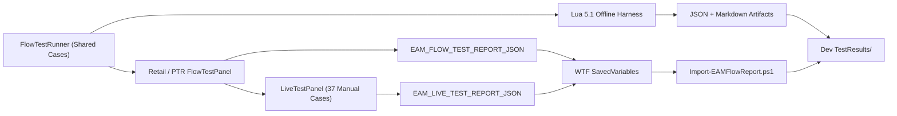

<!-- EAM_DOCUMENTATION_SOURCE: enUS -->
# Flow Validation & Behavioral Verification Framework

## 1. Purpose & Guiding Principles

Verification in EAM goes beyond static linting and `luac -p` syntax checks. This framework establishes reproducible behavioral evidence across five distinct tiers:

1. Static constraint and architecture boundary scans.
2. Lua 5.1 syntax compatibility checks.
3. Offline mocked behavioral flow tests (84+ automated scenarios).
4. Live WoW Retail / PTR in-game behavioral runs.
5. Bidirectional JSON / Markdown test report synchronization.

**Rule of Evidence**: Each verification tier is strictly separated. Passing offline tests must never be claimed as live in-game verification.

---

## 2. Architecture & Components



| Component | Execution Environment | Core Responsibility | Shipped in AddOn Package |
| :--- | :--- | :--- | :---: |
| `Debug/FlowTestRunner.lua` | Offline & In-Game | Case registry, suite execution, async completion, JSON output | Yes |
| `Debug/FlowTestPanel.lua` | Retail / PTR Client | Interactive UI panel, test runner controls, clipboard export | Yes |
| `Debug/ValidationEnvironment.lua` | Offline & In-Game | Cross-verifies client build, Interface, and test-build flags | Yes |
| `Debug/LiveTestSession.lua` | Retail / PTR Client | 37-case manual verification tracking, `/reload` checkpoints | Yes |
| `Tests/FlowValidationHarness.lua` | Lua 5.1 Standalone | Mocks WoW APIs and directly loads production runtime modules | No |
| `.AI/Tools/Run-FlowValidation.ps1` | Dev Environment | CLI test executor, generates test reports | No |
| `.AI/Tools/Test-ValidationContracts.ps1` | Dev Environment | Verifies 496+ AST contracts, JSON schemas, and locale parity | No |

---

## 3. Test Execution Commands

### Offline CLI Test Commands:
```powershell
# 1. Check Lua 5.1 Syntax across all files
pwsh -NoProfile -File .\.AI\Tools\CheckLuaSyntax.ps1

# 2. Run Offline Flow Validation Suites (quick, core, boundary, all)
pwsh -NoProfile -File .\.AI\Tools\Run-FlowValidation.ps1 -Suite all

# 3. Verify Project Integrity & AST Validation Contracts (496 assertions)
pwsh -NoProfile -File .\.AI\Tools\Test-ValidationContracts.ps1
```

### In-Game Slash Commands:
- `/eam test`: Open interactive Flow Test Panel.
- `/eam test quick`: Run quick smoke test suite.
- `/eam test core`: Run core event/scheduler test suite.
- `/eam test boundary`: Run Secret / Protected API boundary tests.
- `/eam test live`: Open 37-case live human sign-off panel.
