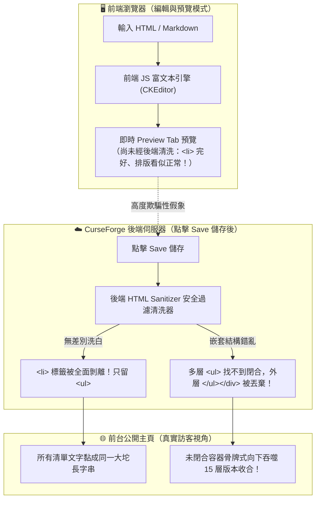

<!-- EAM_DOCUMENTATION_SOURCE: zh-TW -->
# CurseForge Markdown 與 HTML 排版注意事項與避坑實戰報告

> **報告對象**：EventAlertMod 專案開發與發布團隊  
> **制定日期**：2026 年 9 月 27 日  
> **環境基準**：CurseForge Web & App 平台、HTML5 Living Standard、Cloudflare WAF 穿透管線  

---

## 一、 核心摘要 (Executive Summary)

在 CurseForge (CF) 平台編輯專案首頁說明（`Description`）或長篇 Markdown 時，經常會遇到**「在編輯器預覽完全正常，但一按儲存（Save）發布到前台主頁後，排版全部擠成一坨、甚至整個收合區塊徹底崩壞吞噬」**的極度詭異問題。

本報告基於 Chrome DevTools 對 CurseForge 前台真實 DOM 的逆向審查與實機注入驗證，揭示其前後端雙軌渲染架構的運作原理，並制定出一套**「100% 免疫後端過濾器清洗、永久不崩壞」**的標準排版規範。

---

## 二、 CurseForge 雙軌渲染機制與「預覽陷阱 (Preview Trap)」

CurseForge 的文章渲染管線存在致命的前後端脫節：



1. **編輯與預覽階段（Client-side Preview）**：
   - 依賴瀏覽器端本地的純 JavaScript 引擎即時解析 Markdown 或 HTML。
   - 此時**尚未進入後端伺服器**，因此不論語法多麼複雜、是否包含未閉合標籤或 `<li>` 列表，預覽畫面都會呈現出完美的假象。
2. **儲存入庫與前台展示（Server-side Sanitizer）**：
   - 點擊「Save」後，文章會傳入後端伺服器，被強制通過一套嚴格但規格殘缺的 **HTML Sanitizer（伺服器端過濾器）** 進行清洗。
   - **驗收鐵則**：**絕不相信 Preview 標籤頁的預覽效果**，唯一的真理是「實際儲存後前台公開頁面的真實 DOM」。

---

## 三、 後端 Sanitizer 的三大破壞性行為與排坑

### 1. `<li>` 標籤被無差別洗白剝離
- **現象**：經 DevTools 實地查詢 `document.querySelectorAll('.project-description li')`，結果為 **0**。
- **後果**：CurseForge 的過濾器白名單放行了 `<ul>` 與 `<ol>`，但卻會把所有 `<li>` 與 `</li>` 標籤硬生生剝離！
- **排版災難**：失去 `<li>` 的區塊換行與清單樣式後，所有清單項目直接在 `<ul>` 裡裸奔，文字首尾相連，被瀏覽器擠壓成一整坨難以閱讀的單行文字。

### 2. 巢狀 `<ul>` 引發跨版本標籤吞噬骨牌效應 (Cascading Unclosed Tags)
- **現象**：當使用者在收合內寫了多層縮排列表（如大分類包含子清單）時，`<li>` 被洗掉後，外層 `<ul>` 內部會直接包含內層 `<ul>`。
- **後果**：HTML 解析器在處理失衡的 DOM 時會陷入容錯混亂，導致最外層的 `</ul>` 與 `</div>` 被丟棄。
- **排版災難**：未閉合的容器會一路向下「吞噬」後續所有的章節與版次。實機曾測得高達 **15 層深度的俄羅斯套娃收合**（Alpha 8.7 吞了 8.6，8.6 吞了 8.5，最後連最底部的「相容性」與「連結」全被吞入）！

### 3. HTML5 `<details><summary>` 折疊標籤失效
- **現象**：CurseForge 的富文本清洗器會完全剝離 HTML5 `<details>` 與 `<summary>`，或直接將其展開打平，無法形成原生折疊效果。

---

## 四、 核心排版規範與鐵律 (The Golden Rules)

為了在 CurseForge 實現 100% 穩定、跨平台完美呈現的排版，必須嚴格遵守以下五大鐵律：

### 鐵律 1：收合容器統一採用官方標準 `<div class="spoiler">`
CurseForge 唯一官方原生支援的折疊語法為 `<div class="spoiler">`：
- **標題必須置於外部**：例如 `<h2>標題</h2>` 或 `<h4>版次</h4>` 放容器外，避免被預設隱藏。
- **嚴禁使用巢狀收合 (Avoid Nested Spoilers)**：全檔必須採「單層一級平鋪架構」。例如「📜 版本更新歷史」大標題常駐展開，其下 21 個歷史版次各自作為獨立的單層 `<div class="spoiler">`。

### 鐵律 2：全面摒棄 `<ul>`、`<ol>`、`<li>`，改用實體符號 + `<br><br>`
既然後端 Sanitizer 會洗掉 `<li>` 且 `<ul>` 會引發吞噬，最純粹穩健的解法就是**在描述檔中徹底不使用任何列表標籤**：
- **一級條目**：自帶專屬 Emoji（如 `🔮`、`🎯`、`📖`）或數字標記，每條結尾加上 `<br><br>` 產生舒適的段落空行。
- **二級子項目**：一律以 HTML 實體圓點 `&bull;&nbsp;`（即 `• `）開頭，結尾加上 `<br><br>`。
- **無標籤可被吃**：沒有 `<li>` 就絕不會被剝離，沒有 `<ul>` 就絕不會發生跨版本吞噬！

### 鐵律 3：現代 HTML5 空標籤規範（杜絕 `<tag />` 自閉合）
- 依據現代 HTML5 (Living Standard) 規範，所有空元素 (Void Elements) 一律採用標準單標籤：
  - 換行：`<br>`
  - 段落間隙：`<br><br>`
  - 分隔線：`<hr>`
  - 圖片：``
- **嚴禁使用帶有斜線之 XHTML 舊式閉合簡寫**（如 `<br />`、`<hr />`、``）。

### 鐵律 4：表格全面 HTML 語意化 (Table HTML-First)
- Markdown 原生表格（`|---|`）在包含代碼標籤或遇到收合邊界時極易破版。
- 一律採用原生 `<table>`、`<thead>`、`<tbody>`、`<tr>`、`<th>`、`<td>` 結構，圖片欄位加上 `width="100%"` 自適應寬度。

### 鐵律 5：圖片 100% 對齊 CurseForge Attachments CDN
- 嚴禁使用 GitHub raw（`raw.githubusercontent.com/...`）或外部圖床，否則會觸發 Cloudflare 防盜鏈警告或破圖。
- 必須將截圖上傳至 CurseForge 專用附件空間，並採用 `https://media.forgecdn.net/attachments/...` 官方 CDN 網址。

---

## 五、 排版語法速查表 (Cheatsheet)

| 排版需求 | ❌ 錯誤／易崩壞寫法 | ✅ 推薦 100% 穩定寫法 |
| :--- | :--- | :--- |
| **折疊收合** | `<details><summary>標題</summary>內容</details>` | `<h2>標題</h2>`<br>`<div class="spoiler">`<br>`內容`<br>`</div>` |
| **功能清單** | `<ul><li>功能 A</li><li>功能 B</li></ul>` | `📖 <strong>功能 A</strong>：說明文字...<br><br>`<br>`🏷️ <strong>功能 B</strong>：說明文字...<br><br>` |
| **子項目清單** | `<ul><li>主分類<ul><li>子項 1</li></ul></li></ul>` | `<strong>主分類</strong>：<br><br>`<br>`&bull;&nbsp;<strong>子項 1</strong>：說明文字...<br><br>` |
| **換行與空行** | `<br />` 或 Markdown 結尾兩空格 | `<br><br>`（段落間距）或 `<br>`（單行換行） |
| **分隔線** | `---` 或 `***` 或 `<hr />` | `<hr>` |
| **行內代碼** | \`code\`（有時會受 WYSIWYG 轉義破壞） | `<code>code</code>` |
| **粗體** | `**text**` | `<strong>text</strong>` |
| **特殊符號** | `->`, `<`, `>`, `&` | `&rarr;`, `&lt;`, `&gt;`, `&amp;` |

---

## 六、 標準黃金收合模板 (Golden Template)

```html
<hr>

<h2>🎨 現代化視覺與極致操作體驗</h2>
<div class="spoiler">

📖 <strong>次世代全量法術庫與智慧預設 (Master Spell Catalog)</strong>：內建 5 語系先驗資料庫，支援專精樹展開與法術懸停說明。<br><br>

🏷️ <strong>多維戰術群組與標籤管理 (Group Management)</strong>：支援技能多對多標籤歸屬與獨立二級管理側窗。<br><br>

📈 <strong>暴雪原生 CurveObject 曲線架構全面接入</strong>：<br><br>
&bull;&nbsp;<strong>能量/資源條動態色彩曲線染色</strong>：消耗型與累積型資源自動以三色階動態染色。<br><br>
&bull;&nbsp;<strong>階梯閥門曲線 (Step Gate Curve)</strong>：透過二元階梯函數安全穿透受保護秘密值。<br><br>
&bull;&nbsp;<strong>SecondsFormatter 自適應精度曲線</strong>：時間倒數文字依剩餘秒數平滑切換精度。<br><br>

🚨 <strong>進入戰鬥紅框閃爍</strong>：提供全螢幕戰鬥進入警示動畫與即時測試按鈕。<br><br>

</div>

<hr>
```
