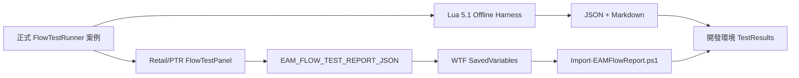

<!-- EAM_DOCUMENTATION_SOURCE: zh-TW -->
# EAM 流程驗證與開發回灌框架

## 1. 目的

EAM 的驗證不能停在 API 限制掃描與 `luac -p`。本框架補上可重播的行為流程證據：

1. 靜態限制與架構邊界。
2. Lua 5.1 語法。
3. 離線 Mock 流程。
4. WoW Retail／PTR 實機流程。
5. JSON／Markdown 報告回灌。

每一層證據都必須獨立標示；離線通過不得宣稱實機通過。

## 2. 架構



| 元件 | 執行環境 | 責任 | 發布包 |
| --- | --- | --- | --- |
| `Debug/FlowTestRunner.lua` | 離線與遊戲內 | 案例註冊、suite、非同步完成、JSON 報告 | 是 |
| `Debug/FlowTestPanel.lua` | Retail／PTR | 測試按鈕、狀態、複製報告 | 是 |
| `Tests/FlowValidationHarness.lua` | Lua 5.1 | Mock WoW API 並直接載入正式模組 | 否 |
| `Tools/Run-FlowValidation.ps1` | 開發端 | 執行 suite，輸出 JSON／Markdown | 否 |
| `Tools/Import-EAMFlowReport.ps1` | 開發端 | 匯入 WTF 或 JSON，驗證 schema | 否 |
| `EAM_FLOW_TEST_REPORT_JSON` | WoW SavedVariables | 保存最後一次使用者觸發報告字串 | 僅資料 |

## 3. Suite 與內建案例

| Suite | 案例 | 驗證內容 |
| --- | --- | --- |
| quick | `boot.initialized` | Main 初始化完成 |
| quick／core | `event.custom_roundtrip` | 自訂事件註冊、派發、移除 handler |
| core | `scheduler.next_frame` | 中央 Scheduler 非同步 callback 與 queue 歸零 |
| quick／core | `saved_variables.contract` | schema、alerts 與公開 mutation API |
| boundary | `boundary.safe_scalar` | Secret/access helper 的安全普通值路徑 |
| boundary | `runtime_probe.schema` | 實機能力探針的環境、capability 與摘要結構 |
| quick／boundary | `report.json_roundtrip` | JSON serializer 與案例陣列契約 |

`all` 會執行全部案例。新增跨模組流程時，需在正式 runner 註冊案例，離線 harness 自動取得同一案例。

## 4. 離線執行

完整驗證：

```powershell
powershell -NoProfile -ExecutionPolicy Bypass -File .\Tools\CheckLuaSyntax.ps1
powershell -NoProfile -ExecutionPolicy Bypass -File .\Tools\Run-FlowValidation.ps1 -Suite all
```

可用 suite：

```powershell
.\Tools\Run-FlowValidation.ps1 -Suite quick
.\Tools\Run-FlowValidation.ps1 -Suite core
.\Tools\Run-FlowValidation.ps1 -Suite boundary
.\Tools\Run-FlowValidation.ps1 -Suite all
```

輸出位於 `TestResults/`，預設不納入 Git。若任何案例為 `failed` 或 `pending`，工具回傳 exit code 1。

## 5. 遊戲內實機流程

實機前先執行本機版本與 SymbolicLink 斷言：

```powershell
powershell -NoProfile -ExecutionPolicy Bypass `
    -File .\Tools\Test-LocalWoWEnvironment.ps1
```

工具以 WoW 主程式 `ProductVersion` 比對預期 patch train，並確認 `_retail_`、`_ptr_`、`_xptr_` 的 `Interface\AddOns\EventAlertMod` 仍是指向 `D:\EventAlertMod` 的 Reparse Point。失敗時回傳 exit code 1，禁止繼續實機簽收；完整 build 與連結證據輸出至 `TestResults/`。

非戰鬥中使用：

- Options 底部「流程測試」按鈕。
- `/eam test`：開啟面板。
- `/eam test quick`
- `/eam test core`
- `/eam test boundary`
- `/eam test all`

面板提供 Quick、Core、Boundary、All 與「複製開發報告」按鈕。第一次建立面板若在戰鬥中提出，會延後至 `PLAYER_REGEN_ENABLED`。

實機報告只代表 runner 在該客戶端成功執行；RQA 仍需補齊：

- Retail 或 PTR build。
- 角色、職業、專精與場景。
- 戰鬥／非戰鬥狀態。
- Lua error、taint log、blocked action。
- 必要畫面或影片。

## 6. 開發回灌

遊戲內 runner 完成後會更新獨立 SavedVariable：

```lua
EAM_FLOW_TEST_REPORT_JSON = "{...}"
```

本機開發基準根目錄為：

```text
D:\World of Warcraft
```

目前已確認 `_retail_`、`_ptr_`、`_xptr_` 都有 `WTF` 與 `Interface\AddOns`。2026-06-22 的客戶端映射為：

| 版本樹 | 執行檔 | 實際版本 | 流程證據用途 |
| --- | --- | --- | --- |
| `_retail_` | `Wow.exe` | 12.0.7.68256 | 正式服 |
| `_ptr_` | `WowT.exe` | 12.1.0.68209 | 12.1 PTR |
| `_xptr_` | `WowT.exe` | 12.0.7.68182 | 12.0.7 PTR |

EAM 實機報告候選路徑依測試客戶端推導：

```text
D:\World of Warcraft\_retail_\WTF\Account\<ACCOUNT>\SavedVariables\EventAlertMod.lua
D:\World of Warcraft\_ptr_\WTF\Account\<ACCOUNT>\SavedVariables\EventAlertMod.lua
D:\World of Warcraft\_xptr_\WTF\Account\<ACCOUNT>\SavedVariables\EventAlertMod.lua
```

匯入前必須先確認測試使用的客戶端版本，不得從 Classic 版本樹取證，也不得將帳號或角色名稱寫入文件與報告。`_retail_`、`_ptr_`、`_xptr_` 的 `Interface\AddOns\EventAlertMod` 都是指向 `D:\EventAlertMod` 的 Windows `SymbolicLink`；回灌流程只能讀取 WTF，嚴禁以安裝、覆蓋、清理或重建連結處理這些 AddOns 路徑。完整規則見 `Docs/27_LOCAL_WOW_ENVIRONMENT.md`。

匯入命令：

```powershell
powershell -NoProfile -ExecutionPolicy Bypass `
    -File .\Tools\Import-EAMFlowReport.ps1 `
    -Path '<EventAlertMod.lua 或 report.json>'
```

輸出位於 `TestResults/Imported/`。匯入工具不修改 WTF。

## 7. 報告契約

```json
{
  "schema": 1,
  "type": "EAM_FLOW_VALIDATION_REPORT",
  "suite": "all",
  "status": "pass",
  "environment": {
    "source": "offline-mock|retail-client",
    "interface": 120007,
    "initialized": true,
    "inCombat": false,
    "locale": "zhTW"
  },
  "summary": {
    "total": 7,
    "passed": 7,
    "failed": 0,
    "skipped": 0,
    "pending": 0
  },
  "cases": [],
  "boundaryWarnings": []
}
```

報告只能包含測試控制值與確認安全的環境欄位；不得包含 Secret、Protected、完整 SavedVariables、無界限事件日誌或原始 Aura／Cooldown facts。

## 8. 新增案例規則

1. 使用穩定案例 ID：`domain.behavior`。
2. 以 `FlowTestRunner.registerCase` 註冊。
3. 指定 quick／core／boundary suite。
4. 同步案例直接回傳 `true/false, message`。
5. 非同步案例回傳 `"pending"`，完成時呼叫 `context.complete`。
6. 測試完成後清理 EventRouter handler、Scheduler task 與任何暫時狀態。
7. 不修改玩家設定；若案例必須測試 mutation，使用複本或完整 rollback。
8. 更新本文件、測試計畫與問題紀錄。

## 9. 封裝與發布 gate

正式封裝預設執行：

1. TOC 路徑與一致性。
2. Lua 5.1 語法。
3. 離線 `all` 流程。
4. 敏感資訊掃描。
5. zip 排除檢查。

`-SkipFlowValidation` 只可用於診斷工具環境問題，不得作為正式發布常態。即使封裝通過，仍不代表 Retail／PTR 實機通過。

## 10. 已知限制

- Offline Harness 不具 WoW C++ Secret、Forbidden、taint 或 protected frame 語意。
- `boundary.safe_scalar` 只驗證普通安全值路徑；真實 Secret 必須在遊戲內由安全 UI 通道觀察。
- 流程面板不執行施法、物品使用、改目標或 secure action。
- 報告不自動上傳網路；回灌必須由使用者複製 JSON 或提供 WTF 檔。
- 12.1 AuraContainer／AuraButton 行為需另增 PTR 實機案例。

## 2026-07-26：aura121 suite

- 新增 `Tests/Mocks/WoW121AuraMock.lua`，AuraContainer/AuraButton 使用嚴格方法白名單；未知方法直接失敗。
- 新增 `aura121` suite 與遊戲內「12.1 Aura」按鈕、`/eam test aura121`。
- 案例覆蓋 capability、零 Legacy pipeline、Slot/Group compiler、容器重建、戰鬥 pending、三種 Sound ID 與 no-op revision。
- 2026-07-26 本輪離線 `aura121` 初版為 7/7；補入 12.0.7、migration、ShadowHost 案例後，`all` 為 17/17。報告位於 `TestResults/`。
- 這些結果只證明 Lua 呼叫契約；PTR Widget、聲音、Forbidden、taint、CPU/GC 仍由 RQA 簽收。
