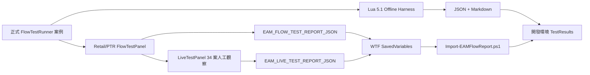

<!-- EAM_DOCUMENTATION_SOURCE: zh-TW -->
# EAM 流程驗證與開發回灌框架

## 1. 目的

EAM 的驗證不能停在 API 限制掃描與 `luac -p`。本框架補上可重播的行為流程證據：

1. 靜態限制與架構邊界。
2. Lua 5.1 語法。
3. 離線 Mock 流程。
4. WoW Retail／PTR 實機流程。
5. JSON／Markdown 報告回灌。

每一層證據都必須獨立標示；離線通過不得宣稱實機通過。

## 2. 架構



| 元件 | 執行環境 | 責任 | 發布包 |
| --- | --- | --- | --- |
| `Debug/FlowTestRunner.lua` | 離線與遊戲內 | 案例註冊、suite、非同步完成、JSON 報告 | 是 |
| `Debug/FlowTestPanel.lua` | Retail／PTR | 測試按鈕、狀態、複製報告 | 是 |
| `Debug/ValidationEnvironment.lua` | 離線與遊戲內 | client build／Interface／宣告版本身分與三個原始 test-build 旗標交叉驗證 | 是 |
| `Debug/LiveTestSession.lua` | Retail／PTR | 34 案人工狀態、boot-token `/reload` checkpoint、戰鬥寫入守衛、備註遮蔽與真人 JSON | 是 |
| `Debug/LiveTestPanel.lua` | Retail／PTR | 玩家人工記錄與複製報告，不自動操作遊戲 | 是 |
| `Tests/FlowValidationHarness.lua` | Lua 5.1 | Mock WoW API 並直接載入正式模組 | 否 |
| `Tools/Run-FlowValidation.ps1` | 開發端 | 執行 suite，輸出 JSON／Markdown | 否 |
| `Tools/Import-EAMFlowReport.ps1` | 開發端 | 匯入 WTF 或 JSON，驗證 Flow／Live schema、重算 summary 與 raw build flags、核對 client 身分並拒絕隱私值 | 否 |
| `Tools/Test-ValidationContracts.ps1` | 開發端 | 驗證 JSON Schema、21 點／34 案 Lua 同步、continuity drift、PowerShell AST 與匯入器正反例 | 否 |
| `EAM_FLOW_TEST_REPORT_JSON` | WoW SavedVariables | 保存最後一次使用者觸發報告字串 | 僅資料 |
| `EAM_LIVE_TEST_REPORT_JSON` | WoW SavedVariables | 保存最後一次玩家人工簽收報告字串 | 僅資料 |

## 3. Suite 與內建案例

| Suite | 案例 | 驗證內容 |
| --- | --- | --- |
| quick | `boot.initialized` | Main 初始化完成 |
| quick／core | `event.custom_roundtrip` | 自訂事件註冊、派發、移除 handler |
| core | `scheduler.next_frame` | 中央 Scheduler 非同步 callback 與 queue 歸零 |
| quick／core | `saved_variables.contract` | schema、alerts 與公開 mutation API |
| boundary | `boundary.safe_scalar` | Secret/access helper 的安全普通值路徑 |
| boundary | `runtime_probe.schema` | 實機能力探針的環境、capability 與摘要結構 |
| quick／boundary | `report.json_roundtrip` | JSON serializer 與案例陣列契約 |

`all` 會執行全部案例。新增跨模組流程時，需在正式 runner 註冊案例，離線 harness 自動取得同一案例。

## 4. 離線執行

完整驗證：

```powershell
powershell -NoProfile -ExecutionPolicy Bypass -File .\Tools\CheckLuaSyntax.ps1
powershell -NoProfile -ExecutionPolicy Bypass -File .\Tools\Run-FlowValidation.ps1 -Suite all
pwsh -NoProfile -File .\Tools\Test-ValidationContracts.ps1
```

可用 suite：

```powershell
.\Tools\Run-FlowValidation.ps1 -Suite quick
.\Tools\Run-FlowValidation.ps1 -Suite core
.\Tools\Run-FlowValidation.ps1 -Suite boundary
.\Tools\Run-FlowValidation.ps1 -Suite all
```

輸出位於 `TestResults/`，預設不納入 Git。若任何案例為 `failed` 或 `pending`，工具回傳 exit code 1。

## 5. 遊戲內實機流程

實機前先執行本機版本與 SymbolicLink 斷言：

```powershell
powershell -NoProfile -ExecutionPolicy Bypass `
    -File .\Tools\Test-LocalWoWEnvironment.ps1
```

工具以 WoW 主程式 `ProductVersion` 比對預期 patch train，並確認 `_retail_`、`_ptr_`、`_xptr_` 的 `Interface\AddOns\EventAlertMod` 仍是指向 `D:\EventAlertMod` 的 Reparse Point。失敗時回傳 exit code 1，禁止繼續實機簽收；完整 build 與連結證據輸出至 `TestResults/`。

非戰鬥中使用：

- Options 底部「流程測試」按鈕。
- `/eam test`：開啟面板。
- `/eam test quick`
- `/eam test core`
- `/eam test boundary`
- `/eam test aura121`
- `/eam test all`
- `/eam test live` 或 `/eam test manual`：開啟 34 案真人簽收工作台。

能力面板提供 Quick、Core、Boundary、Aura121、All、「雙倒數診斷」、「UnitPower 能力」與「複製開發報告」按鈕；真人工作台另要求玩家選擇 `_ptr_`／`_xptr_`／`_retail_`。第一次建立面板若在戰鬥中提出，會延後至 `PLAYER_REGEN_ENABLED`；既有面板在戰鬥中也不得開始 session、寫入案例／備註、建立 checkpoint 或完成簽收。

真人工作台只記錄玩家觀察，不停留 Tooltip、不點按遊戲按鈕、不施法、不使用物品、不執行巨集、不改目標，也不呼叫 `ReloadUI`。`/reload` checkpoint 與最終寫回都必須由玩家操作。備註只允許匿名觀察，不得輸入帳號、角色、伺服器、WTF 或磁碟絕對路徑。

實機報告只代表 runner 在該客戶端成功執行；RQA 仍需補齊：

- Retail 或 PTR build、Interface、`isTestBuildKnown` 與三個原始 build flags。
- 角色、職業、專精與場景。
- 戰鬥／非戰鬥狀態。
- Lua error、taint log、blocked action。
- 必要畫面或影片。

## 6. 開發回灌

遊戲內 runner 與真人工作台完成後會更新獨立 SavedVariable：

```lua
EAM_FLOW_TEST_REPORT_JSON = "{...}"
EAM_LIVE_TEST_REPORT_JSON = "{...}"
```

面板「複製」直接取得記憶體內最新 JSON。若從 WTF 匯入，完成報告後必須再由玩家自行 `/reload` 或正常登出，WoW 才會把最新 SavedVariables 寫回磁碟；沒有這一步時匯入器讀到的可能仍是舊 schema／舊 session。

本機開發基準根目錄為：

```text
D:\World of Warcraft
```

目前已確認 `_retail_`、`_ptr_`、`_xptr_` 都有 `WTF` 與 `Interface\AddOns`。最近一次 2026-08-08 唯讀快照如下；build 會更新，實機前仍必須重跑環境斷言：

| 版本樹 | 執行檔 | 實際版本 | 流程證據用途 |
| --- | --- | --- | --- |
| `_retail_` | `Wow.exe` | 12.0.7.68974 | 正式服 |
| `_ptr_` | `WowT.exe` | 12.1.0.69189 | 12.1 PTR |
| `_xptr_` | `WowT.exe` | 12.0.7.68887 | 12.0.7 PTR |

EAM 實機報告候選路徑依測試客戶端推導：

```text
D:\World of Warcraft\_retail_\WTF\Account\<ACCOUNT>\SavedVariables\EventAlertMod.lua
D:\World of Warcraft\_ptr_\WTF\Account\<ACCOUNT>\SavedVariables\EventAlertMod.lua
D:\World of Warcraft\_xptr_\WTF\Account\<ACCOUNT>\SavedVariables\EventAlertMod.lua
```

匯入前必須先確認測試使用的客戶端版本，不得從 Classic 版本樹取證，也不得將帳號或角色名稱寫入文件與報告。`_retail_`、`_ptr_`、`_xptr_` 的 `Interface\AddOns\EventAlertMod` 都是指向 `D:\EventAlertMod` 的 Windows `SymbolicLink`；回灌流程只能讀取 WTF，嚴禁以安裝、覆蓋、清理或重建連結處理這些 AddOns 路徑。完整規則見 `Docs/27_LOCAL_WOW_ENVIRONMENT.md`。

匯入命令：

```powershell
powershell -NoProfile -ExecutionPolicy Bypass `
    -File .\Tools\Import-EAMFlowReport.ps1 `
    -Path '<EventAlertMod.lua 或 report.json>'
```

輸出位於 `TestResults/Imported/`。匯入工具不修改 WTF。

## 7. 報告契約

```json
{
  "schema": 2,
  "type": "EAM_FLOW_VALIDATION_REPORT",
  "purpose": "offline-contract|capability-probe",
  "matrixVersion": "2026-08-08.1",
  "suite": "all",
  "status": "pass",
  "environment": {
    "executionSource": "offline-mock|client",
    "source": "offline-mock|ptr-live-manual|xptr-live-manual|retail-live-manual",
    "declaredInstallation": "offline|_ptr_|_xptr_|_retail_",
    "channelValidation": "pass|mismatch|unconfirmed",
    "interface": 120007,
    "isTestBuild": true,
    "isTestBuildKnown": true,
    "buildFlags": {
      "isPublicTestClient": true,
      "isTestBuild": true,
      "isBetaBuild": false
    },
    "initialized": true,
    "inCombat": false,
    "locale": "zhTW"
  },
  "summary": {
    "total": 32,
    "passed": 32,
    "failed": 0,
    "skipped": 0,
    "pending": 0
  },
  "cases": [],
  "boundaryWarnings": []
}
```

真人簽收使用獨立契約：

```json
{
  "schema": 1,
  "type": "EAM_LIVE_VALIDATION_REPORT",
  "purpose": "rqa-signoff",
  "matrixVersion": "2026-08-08.1",
  "status": "pass|fail|incomplete",
  "session": {
    "phase": "active|complete",
    "reloadSequence": 1,
    "resumedAfterReload": true,
    "humanObserved": true
  },
  "environment": {
    "executionSource": "client",
    "declaredInstallation": "_ptr_|_xptr_|_retail_",
    "source": "ptr-live-manual|xptr-live-manual|retail-live-manual",
    "isTestBuild": true,
    "isTestBuildKnown": true,
    "buildFlags": {
      "isPublicTestClient": true,
      "isTestBuild": true,
      "isBetaBuild": false
    }
  },
  "automation": {
    "gameInputAutomated": false,
    "reloadUIAutomated": false,
    "playerOperated": true
  },
  "summary": { "total": 29, "required": 29 },
  "cases": [],
  "boundaryWarnings": []
}
```

對應 schema 位於 `Schemas/EAM_FlowValidationReport.schema.json` 與 `Schemas/EAM_LiveValidationReport.schema.json`。Live `pass` 由 schema 同時約束 complete phase、至少一次 reload、已知 build identity、29/29、零 warning；schema 1 Flow 缺少可信 client identity，只能輸出 `legacy-unverified` 並以 exit code 1 拒絕簽收。

報告只能包含測試控制值與確認安全的環境欄位；不得包含 Secret、Protected、完整 SavedVariables、無界限事件日誌、原始 Aura／Cooldown facts、帳號／角色／伺服器或檔案系統路徑。遊戲內先遮蔽，匯入器仍會遞迴檢查屬性名稱與字串值。

## 8. 新增案例規則

1. 使用穩定案例 ID：`domain.behavior`。
2. 以 `FlowTestRunner.registerCase` 註冊。
3. 指定 quick／core／boundary suite。
4. 同步案例直接回傳 `true/false, message`。
5. 非同步案例回傳 `"pending"`，完成時呼叫 `context.complete`。
6. 測試完成後清理 EventRouter handler、Scheduler task 與任何暫時狀態。
7. 不修改玩家設定；若案例必須測試 mutation，使用複本或完整 rollback。
8. 更新本文件、測試計畫與問題紀錄。

## 9. 封裝與發布 gate

正式封裝預設執行：

1. TOC 路徑與一致性。
2. Lua 5.1 語法。
3. 離線 `all` 流程。
4. JSON Schema、21 點／34 案 Lua 同步、continuity drift、TOC 與 PowerShell AST 契約。
5. 敏感資訊掃描。
6. zip 排除檢查。

`-SkipFlowValidation` 只可用於診斷工具環境問題，不得作為正式發布常態。即使封裝通過，仍不代表 Retail／PTR 實機通過。

## 10. 已知限制

- Offline Harness 不具 WoW C++ Secret、Forbidden、taint 或 protected frame 語意。
- `boundary.safe_scalar` 只驗證普通安全值路徑；真實 Secret 必須在遊戲內由安全 UI 通道觀察。
- 流程面板不執行施法、物品使用、改目標或 secure action。
- 報告不自動上傳網路；回灌必須由使用者複製 JSON 或提供 WTF 檔。
- 12.1 AuraContainer／AuraButton 案例已納入 34 案矩陣，但仍需 PTR 實機完成。
- WoW 只在 `/reload`、正常登出等保存時機把記憶體內 SavedVariables 寫回 WTF；直接讀檔前必須確認玩家已完成保存。

## 2026-07-26：aura121 suite

- 新增 `Tests/Mocks/WoW121AuraMock.lua`，AuraContainer/AuraButton 使用嚴格方法白名單；未知方法直接失敗。
- 新增 `aura121` suite 與遊戲內「12.1 Aura」按鈕、`/eam test aura121`。
- 案例覆蓋 capability、零 Legacy pipeline、Slot/Group compiler、容器重建與 18 個建立上限、戰鬥 pending、三種 Sound ID 與 no-op revision。
- 2026-07-26 本輪離線 `aura121` 初版為 7/7；補入 12.0.7、migration、ShadowHost 案例後，`all` 為 17/17。報告位於 `TestResults/`。
- 這些結果只證明 Lua 呼叫契約；PTR Widget、聲音、Forbidden、taint、CPU/GC 仍由 RQA 簽收。

## 2026-07-28：schema 2、文字版面與真人簽收

- `Data/TextPlacementContract.json` 定義 timer／applications 共用的 21 點位置與 8–32 字級；12.0.7 Renderer 與 12.1 NativeAuraRenderer 不再各自硬編碼 inside／outside 分支。
- `Data/LiveValidationMatrix.json` 定義 18 案 `_ptr_`／`_xptr_`／`_retail_` 人工矩陣；`Schemas/` 提供 Flow、Live、Matrix、TextPlacement 四份 schema。
- 新增 `ValidationEnvironment`，將玩家宣告與 `GetBuildInfo`、Interface、test-build 能力交叉驗證；mismatch／unconfirmed 會使報告維持 `incomplete`。
- `LiveTestSession` 支援 500 字元 UTF-8 備註、`/reload` checkpoint 與跨 reload 恢復；18 案、環境、警告或 reload 任一門檻未完成都不能 pass。
- 匯入器重算 summary、矩陣、來源與 client 身分；離線 fixture、舊 schema、錯誤 client profile 或含隱私欄位的報告均 fail-closed。
- 2026-07-28 離線結果：Lua 45/45、Flow `all` 30/30、Validation Contracts 72/72；匯入器接受 schema 2 `offline-mock` 但不升格實機，拒絕 Live offline fixture 與 Flow schema 1。
- `Tools/Test-LocalWoWEnvironment.ps1` 同日通過 3/3：`_retail_` 12.0.7、`_ptr_` 12.1.0、`_xptr_` 12.0.7，三個 EAM Reparse Point 均指向實體專案。
- 使用者指定的 `_ptr_` SavedVariables 於 2026-07-28 唯讀匯入時仍為 Flow schema 1，因此結果是 `legacy-unverified`；必須先在 PTR 載入新版、完成人工矩陣，再 `/reload`／登出寫回磁碟。
- `_ptr_` 12.1 與 `_xptr_` 12.0.7 的真人案例目前皆未簽收；不得以本節離線結果取代。

## 2026-07-29：P1 fail-closed 與既有圖示回歸

- 一般 Renderer 新增 `applyTextLayout()`，設定改變會重套已存在 icon；戰鬥中所有文字／layout 結構寫入只設 pending／dirty，脫戰後回放。Native AuraButton 與所有 child region 則只允許在 `initializeFrame` 內設定，初始化後不再直接 mutation。
- timer／applications／name 字級 slider 拖曳期間只更新 SavedVariables 與一般 icon 預覽；`OnMouseUp`／`OnHide` 提交一次 Native container rebuild。icon size／spacing、swipe alpha 與雙倒數診斷同樣以脫戰重建套用；達容器上限時要求玩家 `/reload`。
- AuraContainer 單次載入建立上限為 18；達上限後保留目前容器並回傳 `nativeReloadRequired`。fingerprint 不再包含全域 revision，只包含實際規則、layout 與必要 sound 契約。
- 較新的 SavedVariables schema 保留原始 `_G.EAM_DB`，執行期改用安全 defaults 複本；不把降版載入冒充 migration。
- 真人 session 沒有 reload evidence 時，即使 34 案全 pass，`complete()` 仍回傳 `reloadRequired`；同次載入 resume 回傳 `sameLoadRejected`，phase 尚為 `active` 時 producer 不得輸出 pass；戰鬥中所有 session mutation 回傳 `combatDeferred`。
- Live／Flow schema 均保留三個原始 build flags。Live pass 必須 `isTestBuildKnown=true` 且至少一個 raw flag 可觀察；匯入器重算 known／aggregate 並拒絕矛盾。備註先遮蔽絕對路徑、UNC、SavedVariables／WTF／Account，匯入器再遞迴拒絕。
- 2026-07-29 最新離線結果：Lua 45/45、Flow `all` 42/42、Validation Contracts 119/119；Flow artifact 為 `TestResults/EAM_FlowValidation_all_20260729_153728.json`，明示 `purpose=offline-contract`、`executionSource/source=offline-mock`、`clientChannel=OFFLINE`。契約測試實際覆蓋完整合成 pass、schema 2 Flow 正向匯入與拒絕案例；這些都只是離線契約證據，不是 PTR／XPTR／Retail 實機簽收。
- `_ptr_` 12.1 與 `_xptr_` 12.0.7 的現行 34 案人工簽收仍未執行，狀態不變。

## 2026-08-01：PTR 回報修正、UnitPower 探針與 continuity gate

- `Core/DurationAdapter.lua` 固化無參數 Duration factory、`SetTimeFromStart`、DurationTextBinding setter 與釋放生命週期；Cooldown、Item、Totem、GroundEffect 與 Renderer 共用。
- Native Aura 正常模式隱藏 CooldownFrame 內建第二套數字；測試面板可明確開啟雙倒數人工診斷。兩套顯示共用 DurationObject，不讀回、不自動比較。
- strict Aura mock 在 `initializeFrame` 結束後鎖定 AuraButton 與所有 child region；任何後置 `SetPoint`、`SetFont`、`SetSize` 直接失敗。樣式 fingerprint 改變只能要求容器重建。
- ItemCooldown 監聽 12.1 `SPELL_UPDATE_COOLDOWN` 的 itemID；GroundEffect 只在非戰鬥解析靜態法術說明／Tooltip SpellDescription，失敗使用 manual fallback。
- ClassPower 次要資源優先，使用 `displayValue` 讓數值 1 仍可見；主要資源 Secret percent 只直送 UnitPower capability probe 的 StatusBar／radial widget，報告不含原值。
- Flow `all` 離線結果為 54/54。Live matrix 升為 `2026-08-08.1`、34 案；三個客戶端仍 pending，離線結果不升格。
- 新增 `Docs/28_PROJECT_CONTINUITY.md`、`Data/ProjectContinuity.json` 與嚴格 Schema；`Tools/Test-ValidationContracts.ps1` 負責 snapshot、ID、issue、矩陣與隱私漂移檢查。
